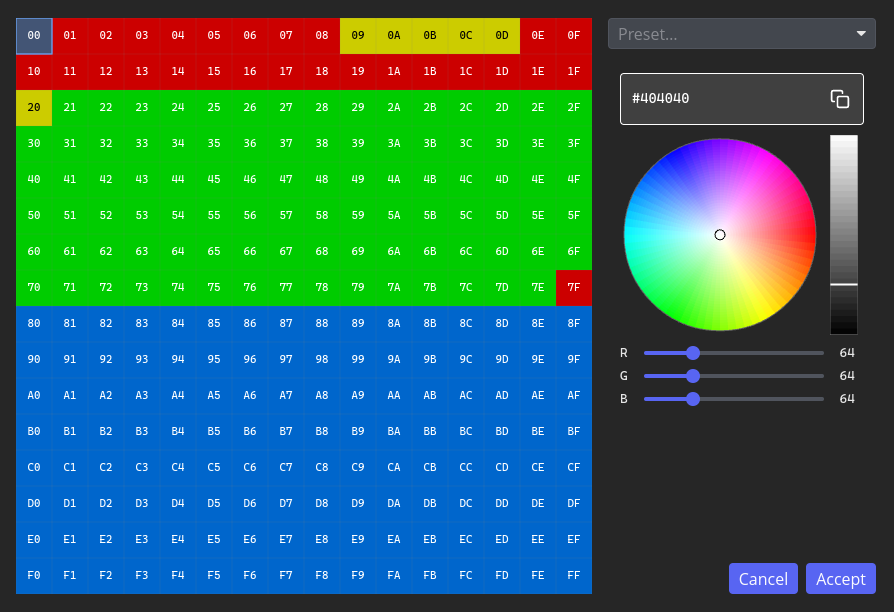

# iced_color_map

Iced widget for editing a 256-entry color map: 16×16 byte grid, HSV/RGB color picker, optional presets, and Accept / Cancel.

The picker UI also lives in the sibling crate [`iced_color_picker`](../iced_color_picker).



## Run the demo

```sh
cargo run --example demo
```